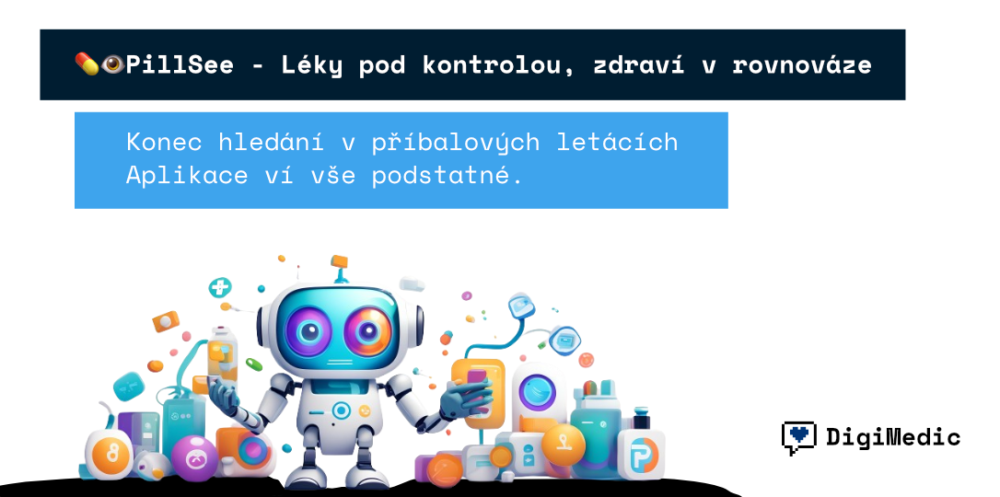

# PillSee - Anonymní Český AI Asistent pro Léky



**Anonymní AI asistent pro informace o českých lécích s podporou fotografování léků a pokročilým vyhledáváním v oficiální SÚKL databázi (67,636 léčivých přípravků).**

## 🌟 Klíčové funkce

- 🤖 **AI Vision** - GPT-4 Vision pro rozpoznání léků z fotografií
- 📱 **PWA aplikace** - Instalovatelná mobilní aplikace s kamerou
- 🇨🇿 **Oficiální SÚKL data** - 67,636 českých léků z data.gov.cz
- 🔒 **Anonymní** - Bez registrace, pouze sessionStorage
- ⚡ **Rychlé** - Vector search s OpenAI embeddings (512 dimenzí)
- 🛡️ **GDPR** - Plná anonymita a ochrana soukromí
- 🏥 **Reálná data** - Automatický import z opendata.sukl.cz

## 🏗️ Technická architektura

```
┌─────────────────┐    ┌─────────────────┐    ┌─────────────────┐
│   Next.js PWA   │    │   FastAPI       │    │   Supabase      │
│   Frontend      │◄──►│   + LangGraph   │◄──►│   PostgreSQL    │
│   (Vercel)      │    │   Backend       │    │   + pgvector    │
└─────────────────┘    └─────────────────┘    └─────────────────┘
                              │
                              ▼
                    ┌─────────────────┐
                    │   OpenAI API    │
                    │   GPT-4 Vision  │
                    │   GPT-4o-mini   │
                    └─────────────────┘
```

## 🚀 Rychlé spuštění

### Prerekvizity
- Node.js 18+
- Python 3.9+
- Supabase účet ([supabase.com](https://supabase.com))
- OpenAI API klíč

### 1. Supabase setup

```bash
# 1. Vytvořte projekt na supabase.com
# 2. V SQL Editoru spusťte:
```

```sql
-- Zkopírujte a spusťte celý obsah supabase-setup.sql
```

### 2. Rychlé nastavení (automatický skript)

```bash
# Spusťte automatický setup skript
chmod +x quick-setup.sh
./quick-setup.sh

# Nebo manuálně:
cd pillsee-backend

# Vytvoření venv
python3 -m venv venv
source venv/bin/activate  # Windows: venv\Scripts\activate

# Instalace závislostí
pip install -r requirements.txt
pip install chardet requests langchain-openai langchain-community  # Opravené závislosti

# Environment proměnné
cp .env.example .env
# Upravte .env s vašimi klíči:
# OPENAI_API_KEY=your_openai_key
# SUPABASE_URL=https://your-project.supabase.co
# SUPABASE_ANON_KEY=your_anon_key
# SUPABASE_SERVICE_KEY=your_service_key (DŮLEŽITÉ pro import dat)
```

### 3. Import SÚKL dat

```bash
# Stažení a import oficiálních českých lékových dat (67,636 léků)
source venv/bin/activate
export $(grep -v '^#' .env | xargs)
python import_sukl_data.py

# Po importu aktualizujte match_medications funkci v Supabase SQL Editoru:
# Zkopírujte a spusťte SQL z supabase-setup.sql pro UUID podporu
```

**⚠️ DŮLEŽITÉ**: Po importu dat je potřeba aktualizovat `match_medications` funkci v Supabase SQL Editoru pro správnou funkčnost vyhledávání (viz supabase-setup.sql).

### 4. Spuštění backendu

```bash
uvicorn app.main:app --reload
# Backend běží na http://localhost:8000
```

### 5. Frontend setup

```bash
cd pillsee-frontend

# Instalace závislostí
npm install

# Environment proměnné
echo "NEXT_PUBLIC_API_BASE_URL=http://localhost:8000" > .env.local

# Spuštění dev serveru
npm run dev
# Frontend běží na http://localhost:3000
```

## 📊 SÚKL Data Processing

### Automatické stahování oficiálních dat
```bash
# Import script automaticky:
# 1. Stahuje oficiální data z data.gov.cz (12.9 MB)
# 2. Zpracovává 67,636 léčivých přípravků
# 3. Podporuje UTF-8 kódování a CSV formát
# 4. Vytváří OpenAI embeddings (512 dimenzí)
# 5. Importuje do Supabase s UUID schématem

python import_sukl_data.py
```

### Oficiální SÚKL data
- **Zdroj**: https://opendata.sukl.cz/soubory/NKOD/DLP/nkod_dlp_lecivepripravky.csv
- **Velikost**: 12.9 MB, 44 datových sloupců
- **Obsah**: 67,636 registrovaných léčivých přípravků
- **Formát**: CSV s čárkovým oddělovačem, UTF-8 kódování
- **ATC kódy**: Místo účinných látek používá oficiální ATC klasifikaci
- **Příklady**: ACYLCOFFIN, HYDROCHLOROTHIAZID LÉČIVA, PREDNISON LÉČIVA

### Fallback testovací data
Pokud oficiální data nejsou dostupná, použije se 28 testovacích léků s kompletními informacemi.

## 🔌 API Endpointy

### Health Check
```bash
GET /health
```

### Textový dotaz
```bash
curl -X POST http://localhost:8000/api/query/text \
  -H "Content-Type: application/json" \
  -d '{"query":"Co je to ACYLCOFFIN a k čemu se používá?"}'
```

### Rozpoznání z obrázku
```bash
curl -X POST http://localhost:8000/api/query/image \
  -H "Content-Type: application/json" \
  -d '{"image_data":"data:image/jpeg;base64,..."}'
```

### Test připojení
```bash
# Test Supabase a databázových funkcí
python test-supabase-connection.py
```

## 📱 PWA Funkce

- **📱 Instalace** - "Add to Home Screen" na mobilu
- **📸 Kamera** - Nativní přístup s flash podporou
- **⚡ Rychlé** - Service Worker caching
- **📶 Offline** - Základní funkčnost bez internetu

## 🔧 Development

### Testování
```bash
# Backend testy
cd pillsee-backend
python -m pytest tests/

# Frontend testy  
cd pillsee-frontend
npm test
```

### Docker Compose
```bash
# Celý stack (bez databáze - používá Supabase)
cp .env.example .env  # Nastavte Supabase klíče
docker-compose up -d
```

## 🚀 Production Deployment

### Backend (Railway/Fly.io)
```bash
# Nastavte environment proměnné:
# OPENAI_API_KEY=your_key
# SUPABASE_URL=https://your-project.supabase.co
# SUPABASE_ANON_KEY=your_anon_key
# SUPABASE_SERVICE_KEY=your_service_key
```

### Frontend (Vercel)
```bash
# Nastavte environment proměnné:
# NEXT_PUBLIC_API_BASE_URL=https://your-backend.railway.app
```

## 🔐 Bezpečnost & GDPR

### Anonymita
- ❌ Žádné uživatelské účty
- ❌ Žádné cookies (kromě GDPR consent)
- ❌ Žádné sledování uživatelů
- ✅ IP-based rate limiting pouze pro ochranu API
- ✅ SessionStorage pro lokální historii

### Medicínské disclaimery
- ⚠️ **Nejsme náhradou za lékařskou péči**
- ⚠️ **Vždy se poraďte s lékařem nebo lékárníkem**
- ⚠️ **Aplikace poskytuje pouze informativní údaje**

## 🛠️ Tech Stack

- **Backend**: FastAPI, LangGraph, OpenAI GPT-4, Supabase
- **Frontend**: Next.js 14, React, TailwindCSS, PWA
- **Database**: Supabase (PostgreSQL + pgvector)
- **AI**: OpenAI GPT-4 Vision, GPT-4o-mini, text-embedding-3-small
- **Data**: SÚKL oficiální léková databáze
- **Deploy**: Vercel (frontend), Railway/Fly.io (backend)

## 📁 Struktura projektu

```
PillSee/
├── README.md                 # Tento soubor
├── pillsee-backend/         # FastAPI backend
│   ├── app/                 # Aplikační kód
│   ├── import_sukl_data.py  # SÚKL data import
│   ├── sukl_data_downloader.py # Pokročilý data downloader
│   └── requirements.txt     # Python závislosti
├── pillsee-frontend/        # Next.js PWA frontend
│   ├── app/                 # Next.js 14 App Router
│   ├── components/          # React komponenty
│   └── utils/               # Frontend utilities
├── supabase-setup.sql       # Databázové schéma s UUID podporou
├── test-supabase-connection.py # Test skript pro Supabase
├── quick-setup.sh           # Automatický setup skript  
├── TERMINOLOGY.md           # Technická dokumentace
├── CLAUDE.md                # Claude context pro vývoj
└── docker-compose.yml       # Docker konfigurace
```

## 📈 Aktuální stav projektu

### Implementované funkce ✅
- ✅ Automatické stahování oficiálních SÚKL dat z data.gov.cz
- ✅ Import 67,636 skutečných českých léčivých přípravků
- ✅ OpenAI embeddings s 512 dimenzemi pro vector search
- ✅ Supabase PostgreSQL + pgvector databáze s UUID schématem
- ✅ FastAPI backend s rate limitingem a CORS
- ✅ Next.js 14 PWA frontend s camera integrací
- ✅ Anonymní sessionStorage bez user trackingu
- ✅ GDPR compliance s medical disclaimery
- ✅ Automatický setup skript (quick-setup.sh)
- ✅ Kompletní test suite pro Supabase připojení

### Aktuální data 📊
- **Léky v databázi**: 67,636 oficálních SÚKL záznamů
- **Velikost dat**: 12.9 MB CSV soubor
- **Aktualizace**: Automatická z opendata.sukl.cz
- **Sloupce**: 44 datových polí (název, síla, forma, ATC kód, atd.)
- **Kódování**: UTF-8 s čárkovým oddělovačem

### Známé problémy 🔧
- ⚠️  `match_medications` funkce vyžaduje ruční SQL update v Supabase
- ⚠️  LangChain deprecation warnings (řešeno novými závislostmi)
- ⚠️  Vector search vyžaduje plný import dat pro optimální výkon

## 🤝 Contributing

1. Fork repository
2. Vytvořte feature branch
3. Commitujte změny
4. Vytvořte Pull Request

## 📜 License

MIT License - viz [LICENSE](LICENSE) soubor

## 🆘 Troubleshooting

### Backend nespustí
```bash
# Zkontrolujte Python verzi
python --version  # Potřebujete 3.9+

# Zkontrolujte závislosti (obzvlášť LangChain)
pip list | grep -E "(fastapi|langchain|openai|supabase)"

# Zkontrolujte .env soubor
cat .env | grep -E "(OPENAI|SUPABASE)"

# Problém s LangChain warnings:
pip install langchain-openai langchain-community
```

### SÚKL import problémy
```bash
# Pokud import selže s "0 platných léků":
# 1. Zkontrolujte SUPABASE_SERVICE_KEY (ne ANON_KEY)
# 2. Ověřte match_medications funkci v Supabase SQL Editoru
# 3. Spusťte test:
python -c "from app.data.sukl_processor import SUKLDataProcessor; print('Import OK')"
```

### Vyhledávání nefunguje
```bash
# Chyba "BIGINT vs UUID":
# Spusťte v Supabase SQL Editoru:
CREATE OR REPLACE FUNCTION match_medications(...)  # viz supabase-setup.sql
```

### Frontend chyby
```bash
# Zkontrolujte Node.js verzi
node --version  # Potřebujete 18+

# Zkontrolujte .env.local
cat .env.local
```

### Databáze problémy
```bash
# Test Supabase připojení
export $(grep -v '^#' pillsee-backend/.env | xargs)
python test-supabase-connection.py

# Statistiky databáze
psql -h your-host -d your-db -c "SELECT COUNT(*) FROM medications;"
```

---

**🏥 PillSee** - Moderní přístup k informacím o lécích pro českou veřejnost.