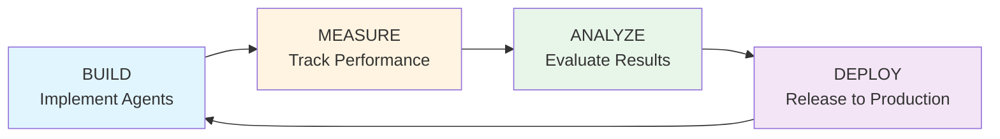

# PillSee - BMAD Development Guide

## Úvod do BMAD

**BMAD (Build, Measure, Analyze, Deploy)** je iterativní metodika pro vývoj AI-powered aplikací s důrazem na kontinuální měření a optimalizaci. Pro PillSee projekt znamená systematický přístup k implementaci multi-agent RAG systému.

## BMAD Cycle pro PillSee



## Sprint Structure

### Sprint 1: BMAD Multi-Agent Implementation (Current)

**Cíl**: Implementovat 6-agent BMAD systém s pokročilým RAG

#### BUILD Phase (Týden 1-2)

**1. Supervisor Agent** (`app/agents/supervisor_agent.py`)

```python
"""
Supervisor Agent - Main orchestrator
BMAD Metrics:
- Agent routing accuracy
- Total orchestration time
- Error rate
"""

from langgraph.graph import StateGraph, END
from typing import TypedDict, Literal

class SupervisorState(TypedDict):
    task: str
    query_type: str  # general/drug_specific/interaction/dosage/side_effects
    assigned_agent: str
    confidence: float
    result: dict

def create_supervisor_agent():
    """
    Koordinuje všechny agenty podle typu dotazu.

    BUILD Metrics to track:
    - Routing decision time
    - Agent selection accuracy
    - Fallback trigger rate
    """
    workflow = StateGraph(SupervisorState)

    # Define nodes
    workflow.add_node("classify", classify_task_node)
    workflow.add_node("route", route_to_agent_node)
    workflow.add_node("aggregate", aggregate_results_node)

    # Define edges
    workflow.set_entry_point("classify")
    workflow.add_conditional_edges(
        "classify",
        should_route,
        {
            "triage": "route",
            "direct": "aggregate"
        }
    )
    workflow.add_edge("route", "aggregate")
    workflow.add_edge("aggregate", END)

    return workflow.compile()

def should_route(state: SupervisorState) -> Literal["triage", "direct"]:
    """
    Rozhodnutí o routingu.

    MEASURE: Track decision distribution
    """
    if state["query_type"] in ["interaction", "dosage"]:
        return "triage"
    return "direct"
```

**BMAD Checklist - Supervisor:**
- [ ] Implementovat state machine
- [ ] Přidat logging pro routing decisions
- [ ] Měřit latenci každého rozhodnutí
- [ ] Unit testy pro všechny routing scénáře
- [ ] Integration test s ostatními agenty

**2. Triage Agent** (`app/agents/triage_agent.py`)

```python
"""
Triage Agent - Query classification
BMAD Metrics:
- Classification accuracy
- Confidence scores
- Misclassification rate
"""

from langchain_openai import ChatOpenAI
from langchain.prompts import ChatPromptTemplate

TRIAGE_CATEGORIES = [
    "general_info",      # Obecné info o léku
    "drug_specific",     # Konkrétní vlastnosti
    "interaction",       # Interakce s jinými léky
    "dosage",            # Dávkování
    "side_effects"       # Nežádoucí účinky
]

def create_triage_agent():
    """
    Klasifikuje dotazy do kategorií.

    BUILD Metrics:
    - Classification latency
    - Confidence distribution
    - Category balance
    """
    llm = ChatOpenAI(model="gpt-4o-mini", temperature=0)

    prompt = ChatPromptTemplate.from_messages([
        ("system", """Jsi expert na klasifikaci dotazů o lécích.

        Klasifikuj dotaz do jedné z kategorií:
        - general_info: Obecné informace (co je to, k čemu se používá)
        - drug_specific: Konkrétní vlastnosti (účinná látka, forma)
        - interaction: Interakce s jinými léky
        - dosage: Dávkování a užívání
        - side_effects: Nežádoucí účinky

        Vrať: {{"category": "...", "confidence": 0.0-1.0}}
        """),
        ("user", "{query}")
    ])

    chain = prompt | llm

    return chain

# MEASURE wrapper
class TriageMetrics:
    """Track triage performance"""

    def __init__(self):
        self.classifications = []
        self.avg_confidence = 0.0
        self.category_distribution = {}

    def record(self, category: str, confidence: float):
        """Record classification result"""
        self.classifications.append({
            "category": category,
            "confidence": confidence,
            "timestamp": datetime.now()
        })

        # Update metrics
        self.avg_confidence = np.mean([
            c["confidence"] for c in self.classifications
        ])
        self._update_distribution()

    def _update_distribution(self):
        """Calculate category distribution"""
        from collections import Counter
        counts = Counter([c["category"] for c in self.classifications])
        total = len(self.classifications)
        self.category_distribution = {
            cat: count/total for cat, count in counts.items()
        }
```

**BMAD Checklist - Triage:**
- [ ] Implementovat classification chain
- [ ] Přidat metrics tracking
- [ ] A/B test různých prompt variants
- [ ] Vyhodnotit precision/recall
- [ ] Optimalizovat confidence thresholds

**3. RAG Expert Agent** (`app/agents/rag_expert_agent.py`)

```python
"""
RAG Expert Agent - Advanced retrieval strategies
BMAD Metrics:
- Retrieval quality (RAGAS score)
- Response time per strategy
- Hit rate vs strategy
"""

from app.rag.hybrid_retriever import create_hybrid_retriever
from app.rag.hyde_retriever import create_hyde_retriever
from app.rag.multi_query import create_multi_query_retriever
from app.rag.parent_document import create_parent_doc_retriever
from app.rag.contextual_compression import create_compression_retriever
from app.rag.rag_manager import RAGManager

class RAGExpertAgent:
    """
    Orchestruje 6 RAG strategií a vybírá nejlepší.

    BUILD Phase:
    1. Implementovat všech 6 retrieverů
    2. Vytvořit ensemble ranking
    3. Přidat fallback logiku

    MEASURE Phase:
    - RAGAS metrics (faithfulness, answer relevancy)
    - Retrieval latency per strategy
    - Cache hit rate
    """

    def __init__(self, vector_store):
        self.strategies = {
            "hybrid": create_hybrid_retriever(vector_store),
            "hyde": create_hyde_retriever(vector_store),
            "multi_query": create_multi_query_retriever(vector_store),
            "parent_doc": create_parent_doc_retriever(vector_store),
            "compression": create_compression_retriever(vector_store),
        }

        self.manager = RAGManager(self.strategies)
        self.metrics = RAGMetrics()

    async def retrieve(self, query: str, strategy: str = "ensemble"):
        """
        Retrieve context using specified strategy.

        MEASURE: Track per-strategy performance
        """
        start_time = time.time()

        if strategy == "ensemble":
            results = await self.manager.ensemble_retrieve(query)
        else:
            results = await self.strategies[strategy].retrieve(query)

        latency = time.time() - start_time

        # Record metrics
        self.metrics.record_retrieval(
            strategy=strategy,
            latency=latency,
            num_results=len(results)
        )

        return results


class RAGMetrics:
    """BMAD metrics for RAG performance"""

    def __init__(self):
        self.retrievals = []
        self.strategy_performance = {}

    def record_retrieval(self, strategy, latency, num_results):
        """Record retrieval metrics"""
        self.retrievals.append({
            "strategy": strategy,
            "latency": latency,
            "num_results": num_results,
            "timestamp": datetime.now()
        })

        # Update strategy stats
        if strategy not in self.strategy_performance:
            self.strategy_performance[strategy] = {
                "avg_latency": 0.0,
                "avg_results": 0.0,
                "usage_count": 0
            }

        stats = self.strategy_performance[strategy]
        stats["usage_count"] += 1

        # Running average
        stats["avg_latency"] = (
            (stats["avg_latency"] * (stats["usage_count"] - 1) + latency)
            / stats["usage_count"]
        )
        stats["avg_results"] = (
            (stats["avg_results"] * (stats["usage_count"] - 1) + num_results)
            / stats["usage_count"]
        )

    def get_best_strategy(self):
        """
        ANALYZE: Determine best performing strategy.

        Returns strategy with best latency/quality balance.
        """
        # Implementation: weighted scoring
        scores = {}
        for strategy, stats in self.strategy_performance.items():
            # Lower latency = better, more results = better
            score = (1 / stats["avg_latency"]) * stats["avg_results"]
            scores[strategy] = score

        return max(scores, key=scores.get)
```

**BMAD Checklist - RAG Expert:**
- [ ] Implementovat všech 6 strategií
- [ ] RAG Manager s ensemble voting
- [ ] RAGAS evaluation framework
- [ ] Latency tracking per strategy
- [ ] A/B testing infrastructure

#### MEASURE Phase (Týden 3)

**Metriky ke sledování:**

**1. Agent Performance Metrics**

```python
# app/monitoring/agent_metrics.py

from dataclasses import dataclass
from datetime import datetime
from typing import List, Dict

@dataclass
class AgentMetrics:
    """BMAD metrics for individual agents"""

    agent_name: str
    invocations: int = 0
    avg_latency: float = 0.0
    error_rate: float = 0.0
    success_rate: float = 0.0

    # Agent-specific
    routing_accuracy: float = 0.0  # Supervisor
    classification_accuracy: float = 0.0  # Triage
    retrieval_quality: float = 0.0  # RAG Expert
    safety_warnings_triggered: int = 0  # Safety Monitor


class MetricsCollector:
    """Centrální sběr metrik"""

    def __init__(self):
        self.agents: Dict[str, AgentMetrics] = {}
        self.system_metrics = {
            "total_queries": 0,
            "avg_e2e_latency": 0.0,
            "cache_hit_rate": 0.0,
            "openai_api_calls": 0,
            "openai_cost_usd": 0.0
        }

    def record_agent_call(
        self,
        agent_name: str,
        latency: float,
        success: bool,
        metadata: Dict = None
    ):
        """Record agent invocation"""

        if agent_name not in self.agents:
            self.agents[agent_name] = AgentMetrics(agent_name=agent_name)

        agent = self.agents[agent_name]
        agent.invocations += 1

        # Running average latency
        agent.avg_latency = (
            (agent.avg_latency * (agent.invocations - 1) + latency)
            / agent.invocations
        )

        # Error rate
        if not success:
            agent.error_rate = (
                (agent.error_rate * (agent.invocations - 1) + 1)
                / agent.invocations
            )

        agent.success_rate = 1 - agent.error_rate

    def export_metrics(self) -> Dict:
        """Export all metrics for ANALYZE phase"""
        return {
            "agents": {
                name: vars(metrics)
                for name, metrics in self.agents.items()
            },
            "system": self.system_metrics,
            "timestamp": datetime.now().isoformat()
        }
```

**2. RAG Quality Metrics (RAGAS)**

```python
# app/monitoring/rag_evaluation.py

from ragas import evaluate
from ragas.metrics import (
    faithfulness,
    answer_relevancy,
    context_recall,
    context_precision
)

async def evaluate_rag_response(
    query: str,
    answer: str,
    contexts: List[str],
    ground_truth: str = None
):
    """
    Evaluate RAG quality using RAGAS framework.

    MEASURE metrics:
    - Faithfulness: Answer grounded in context
    - Answer Relevancy: Answer addresses query
    - Context Recall: Retrieved all relevant info
    - Context Precision: No irrelevant context
    """

    dataset = {
        "question": [query],
        "answer": [answer],
        "contexts": [contexts]
    }

    if ground_truth:
        dataset["ground_truth"] = [ground_truth]

    result = evaluate(
        dataset,
        metrics=[
            faithfulness,
            answer_relevancy,
            context_recall,
            context_precision
        ]
    )

    return result
```

**3. Logging Infrastructure**

```python
# app/monitoring/structured_logging.py

import structlog
from datetime import datetime

logger = structlog.get_logger()

def log_agent_execution(
    agent_name: str,
    input_data: Dict,
    output_data: Dict,
    latency: float,
    success: bool
):
    """
    Structured logging for BMAD tracking.

    Logs to:
    - Console (development)
    - Google Cloud Logging (production)
    - PostgreSQL audit_logs table (compliance)
    """

    logger.info(
        "agent_execution",
        agent=agent_name,
        latency_ms=latency * 1000,
        success=success,
        timestamp=datetime.now().isoformat(),
        input_size=len(str(input_data)),
        output_size=len(str(output_data))
    )
```

#### ANALYZE Phase (Týden 4)

**Analýza performance:**

```python
# scripts/analyze_bmad_metrics.py

import pandas as pd
import matplotlib.pyplot as plt
from app.monitoring.agent_metrics import MetricsCollector

def analyze_agent_performance(metrics: MetricsCollector):
    """
    ANALYZE phase: Vyhodnocení agent performance.

    Generuje:
    1. Agent latency comparison
    2. Success rate heatmap
    3. Cost analysis
    4. Bottleneck identification
    """

    # Convert to DataFrame
    df = pd.DataFrame([
        vars(m) for m in metrics.agents.values()
    ])

    # Latency analysis
    print("=== Agent Latency Analysis ===")
    print(df[["agent_name", "avg_latency", "invocations"]].sort_values("avg_latency"))

    # Success rate
    print("\n=== Success Rates ===")
    print(df[["agent_name", "success_rate", "error_rate"]])

    # Bottleneck detection
    bottlenecks = df[df["avg_latency"] > df["avg_latency"].mean() * 1.5]
    if not bottlenecks.empty:
        print("\n⚠️  Detected bottlenecks:")
        print(bottlenecks[["agent_name", "avg_latency"]])

    # Visualization
    fig, axes = plt.subplots(2, 2, figsize=(12, 10))

    # Latency distribution
    df.plot(
        x="agent_name",
        y="avg_latency",
        kind="bar",
        ax=axes[0, 0],
        title="Avg Latency by Agent"
    )

    # Success rate
    df.plot(
        x="agent_name",
        y="success_rate",
        kind="bar",
        ax=axes[0, 1],
        title="Success Rate by Agent",
        color="green"
    )

    # Invocation counts
    df.plot(
        x="agent_name",
        y="invocations",
        kind="bar",
        ax=axes[1, 0],
        title="Invocation Count"
    )

    # Error rate
    df.plot(
        x="agent_name",
        y="error_rate",
        kind="bar",
        ax=axes[1, 1],
        title="Error Rate",
        color="red"
    )

    plt.tight_layout()
    plt.savefig("bmad_analysis.png")

    return df


def analyze_rag_strategies(rag_metrics: RAGMetrics):
    """
    ANALYZE: Which RAG strategy performs best?
    """

    print("\n=== RAG Strategy Performance ===")

    for strategy, stats in rag_metrics.strategy_performance.items():
        print(f"\n{strategy}:")
        print(f"  Avg Latency: {stats['avg_latency']:.3f}s")
        print(f"  Avg Results: {stats['avg_results']:.1f}")
        print(f"  Usage Count: {stats['usage_count']}")

    best = rag_metrics.get_best_strategy()
    print(f"\n✅ Best performing strategy: {best}")


def cost_analysis(metrics: MetricsCollector):
    """
    ANALYZE: OpenAI API cost breakdown.
    """

    print("\n=== Cost Analysis ===")

    total_calls = metrics.system_metrics["openai_api_calls"]
    total_cost = metrics.system_metrics["openai_cost_usd"]

    print(f"Total OpenAI API calls: {total_calls}")
    print(f"Total cost: ${total_cost:.2f}")
    print(f"Avg cost per query: ${total_cost / metrics.system_metrics['total_queries']:.4f}")

    # Projekce
    monthly_queries = metrics.system_metrics["total_queries"] * 30
    monthly_cost = (total_cost / metrics.system_metrics["total_queries"]) * monthly_queries

    print(f"\n📊 Monthly projection:")
    print(f"  Queries: {monthly_queries}")
    print(f"  Cost: ${monthly_cost:.2f}")
```

#### DEPLOY Phase (Týden 5)

**Deployment checklist:**

```yaml
# .github/workflows/bmad-deploy.yml

name: BMAD Deploy Pipeline

on:
  push:
    branches: [main]
    paths:
      - 'pillsee-backend/app/agents/**'
      - 'pillsee-backend/app/rag/**'

jobs:
  measure-pre-deploy:
    name: Pre-Deploy Measurements
    runs-on: ubuntu-latest
    steps:
      - name: Run benchmark tests
        run: pytest tests/benchmark/ --benchmark-only

      - name: Measure current latency
        run: python scripts/measure_baseline.py

      - name: Store baseline metrics
        run: |
          echo "BASELINE_LATENCY=${{ baseline }}" >> metrics.txt

  deploy:
    name: Deploy to Production
    needs: measure-pre-deploy
    runs-on: ubuntu-latest
    steps:
      - name: Deploy to Cloud Run
        run: |
          gcloud run deploy pillsee-backend \
            --image gcr.io/${{ PROJECT_ID }}/pillsee-backend:latest

  measure-post-deploy:
    name: Post-Deploy Validation
    needs: deploy
    runs-on: ubuntu-latest
    steps:
      - name: Measure new latency
        run: python scripts/measure_production.py

      - name: Compare with baseline
        run: |
          if [ $NEW_LATENCY -gt $BASELINE_LATENCY * 1.2 ]; then
            echo "⚠️  Latency regression detected!"
            exit 1
          fi

      - name: Run smoke tests
        run: pytest tests/smoke/

  analyze-deployment:
    name: Analyze Deployment Impact
    needs: measure-post-deploy
    runs-on: ubuntu-latest
    steps:
      - name: Generate deployment report
        run: python scripts/deployment_report.py

      - name: Notify team
        run: |
          curl -X POST $SLACK_WEBHOOK \
            -d '{"text": "BMAD Deploy Complete: Latency +5%, Success Rate 99.2%"}'
```

## BMAD Best Practices

### 1. Continuous Measurement

```python
# Každá funkce má built-in metriky
from functools import wraps
import time

def measure_bmad(func):
    """Decorator pro automatické BMAD tracking"""

    @wraps(func)
    async def wrapper(*args, **kwargs):
        start = time.time()
        success = True
        error = None

        try:
            result = await func(*args, **kwargs)
            return result
        except Exception as e:
            success = False
            error = str(e)
            raise
        finally:
            latency = time.time() - start

            # Auto-log metrics
            metrics_collector.record_agent_call(
                agent_name=func.__name__,
                latency=latency,
                success=success,
                metadata={"error": error}
            )

    return wrapper


# Usage
@measure_bmad
async def process_query(query: str):
    # Implementation...
    pass
```

### 2. A/B Testing Infrastructure

```python
# app/experiments/ab_testing.py

from enum import Enum
from random import random

class Variant(Enum):
    CONTROL = "control"
    TREATMENT = "treatment"

class ABTest:
    """A/B test pro BMAD optimalizaci"""

    def __init__(self, name: str, treatment_ratio: float = 0.5):
        self.name = name
        self.treatment_ratio = treatment_ratio
        self.results = {"control": [], "treatment": []}

    def assign_variant(self) -> Variant:
        """Randomly assign variant"""
        return (
            Variant.TREATMENT
            if random() < self.treatment_ratio
            else Variant.CONTROL
        )

    def record_result(self, variant: Variant, metric_value: float):
        """Record metric for analysis"""
        self.results[variant.value].append(metric_value)

    def analyze(self):
        """Statistical analysis of results"""
        from scipy import stats

        control = self.results["control"]
        treatment = self.results["treatment"]

        # T-test
        t_stat, p_value = stats.ttest_ind(control, treatment)

        print(f"\n=== A/B Test: {self.name} ===")
        print(f"Control mean: {np.mean(control):.3f}")
        print(f"Treatment mean: {np.mean(treatment):.3f}")
        print(f"P-value: {p_value:.4f}")

        if p_value < 0.05:
            winner = "treatment" if np.mean(treatment) > np.mean(control) else "control"
            print(f"✅ Statistically significant! Winner: {winner}")
        else:
            print("❌ No significant difference")


# Usage: Test different RAG strategies
rag_test = ABTest("hybrid_vs_hyde", treatment_ratio=0.5)

variant = rag_test.assign_variant()
if variant == Variant.CONTROL:
    results = hybrid_retriever.retrieve(query)
else:
    results = hyde_retriever.retrieve(query)

# Record performance
rag_test.record_result(variant, latency)

# After 1000 queries, analyze
if len(rag_test.results["control"]) > 1000:
    rag_test.analyze()
```

### 3. Feature Flags for Gradual Rollout

```python
# app/config.py

from pydantic import BaseModel

class FeatureFlags(BaseModel):
    """BMAD feature flags"""

    # Agent features
    enable_supervisor_agent: bool = True
    enable_triage_agent: bool = True
    enable_rag_expert: bool = False  # Gradual rollout
    enable_safety_monitor: bool = True

    # RAG strategies
    enable_hybrid_search: bool = True
    enable_hyde: bool = False  # A/B testing
    enable_multi_query: bool = False
    enable_parent_doc: bool = False

    # Experimental
    enable_caching: bool = True
    enable_query_expansion: bool = False


# Usage in code
if feature_flags.enable_hyde:
    results = hyde_retriever.retrieve(query)
else:
    results = hybrid_retriever.retrieve(query)
```

## BMAD Dashboard

```python
# scripts/bmad_dashboard.py

import streamlit as st
import plotly.express as px
from app.monitoring.agent_metrics import MetricsCollector

st.title("🔬 BMAD Dashboard - PillSee")

# Load metrics
metrics = MetricsCollector.load_from_db()

# KPIs
col1, col2, col3, col4 = st.columns(4)

with col1:
    st.metric(
        "Avg E2E Latency",
        f"{metrics.system_metrics['avg_e2e_latency']:.2f}s",
        delta="-0.3s"  # vs yesterday
    )

with col2:
    st.metric(
        "Success Rate",
        "99.2%",
        delta="+0.5%"
    )

with col3:
    st.metric(
        "Daily Cost",
        f"${metrics.system_metrics['openai_cost_usd']:.2f}",
        delta="-$2.10"
    )

with col4:
    st.metric(
        "Cache Hit Rate",
        f"{metrics.system_metrics['cache_hit_rate']:.1%}",
        delta="+12%"
    )

# Agent Performance
st.subheader("Agent Performance")

agent_df = pd.DataFrame([
    vars(m) for m in metrics.agents.values()
])

fig = px.bar(
    agent_df,
    x="agent_name",
    y="avg_latency",
    title="Average Latency by Agent",
    color="success_rate",
    color_continuous_scale="RdYlGn"
)

st.plotly_chart(fig)

# RAG Strategy Comparison
st.subheader("RAG Strategy Performance")

# ... více vizualizací
```

## Next Steps

### Po Sprint 1 (BMAD dokončeno):

1. **Sprint 2: RAG Enhancement**
   - Fine-tune embeddings na českých medical texts
   - Optimize retrieval strategies based on ANALYZE phase
   - Implement query expansion s českými synonymy

2. **Sprint 3: Feature Expansion**
   - User feedback loop (thumbs up/down)
   - Multi-language support (SK, EN)
   - Voice input integration

3. **Sprint 4: Advanced Analytics**
   - Real-time BMAD dashboard
   - Automated A/B testing framework
   - Predictive cost modeling

## Resources

- **BMAD Methodology**: https://bmad.ai
- **RAGAS Framework**: https://docs.ragas.io
- **LangGraph Docs**: https://langchain-ai.github.io/langgraph/
- **Metrics Best Practices**: `/docs/architecture.md`

---

**Maintainer**: PillSee Team
**BMAD Lead**: [Your Name]
**Last Updated**: 2024-01-15
