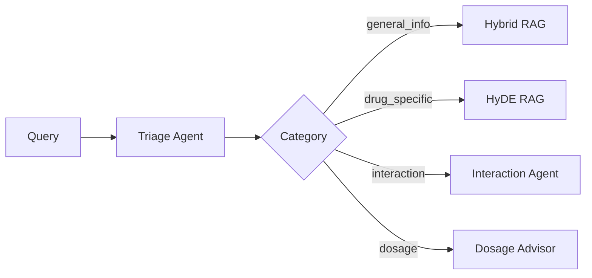

# PillSee - Complete 6-Agent System Architecture

**Version**: 1.0 (BMAD Multi-Agent)
**Status**: Sprint 1 - Designed, Awaiting Implementation
**Last Updated**: 2024-01-15

> **Note**: For detailed system architecture with diagrams, see [System Architecture](architecture/system-architecture.md)

## Executive Summary

PillSee implementuje **6-agent BMAD (Build, Measure, Analyze, Deploy)** multi-agent systém založený na LangGraph orchestraci. Architektura kombinuje pokročilé RAG (Retrieval-Augmented Generation) strategie s compliance-first přístupem (GDPR + MDR Class I).

## High-Level Architecture

```
User Query
    ↓
Supervisor Agent (Orchestrator)
    ↓
Triage Agent (Classifier)
    ↓ ↓ ↓ ↓ ↓ ↓
   ┌─────┬─────┬─────┬──────────┬─────────┐
   │ RAG │Drug │Side │Dosage    │Safety   │
   │Expert│Inter│Eff  │Advisor   │Monitor  │
   └─────┴─────┴─────┴──────────┴─────────┘
    ↓
Aggregated Response + Disclaimer
    ↓
User
```

## Agent Specifications

### 1. Supervisor Agent

**Role**: Main orchestrator
**Location**: `app/agents/supervisor_agent.py`
**Status**: 📋 Designed

**Responsibilities**:
- Route queries to appropriate agents
- Aggregate multi-agent responses
- Handle fallback scenarios
- Manage agent lifecycle

**Inputs**: User query + query type
**Outputs**: Orchestration plan, aggregated result

**BMAD Metrics**:
- Routing accuracy
- Total orchestration time
- Agent selection distribution

**Implementation**:
```python
class SupervisorState(TypedDict):
    task: str
    query_type: str
    assigned_agents: List[str]
    results: Dict[str, Any]
    final_answer: str

def create_supervisor_workflow():
    workflow = StateGraph(SupervisorState)
    workflow.add_node("classify", classify_node)
    workflow.add_node("route", route_node)
    workflow.add_node("aggregate", aggregate_node)
    # ...
    return workflow.compile()
```

---

### 2. Triage Agent

**Role**: Query classification
**Location**: `app/agents/triage_agent.py`
**Status**: 📋 Designed

**Responsibilities**:
- Classify query into categories
- Determine confidence score
- Select appropriate RAG strategy

**Categories**:
1. `general_info` - Obecné informace
2. `drug_specific` - Konkrétní vlastnosti
3. `interaction` - Lékové interakce
4. `dosage` - Dávkování
5. `side_effects` - Nežádoucí účinky

**BMAD Metrics**:
- Classification accuracy (target: > 85%)
- Avg confidence score
- Category distribution

**Implementation**:
```python
CLASSIFICATION_PROMPT = """
Klasifikuj dotaz o léku do jedné z kategorií:
- general_info, drug_specific, interaction, dosage, side_effects

Vrať: {"category": "...", "confidence": 0.0-1.0}
"""

def classify_query(query: str) -> Tuple[str, float]:
    # GPT-4o-mini classification
    pass
```

---

### 3. RAG Expert Agent

**Role**: Advanced retrieval orchestration
**Location**: `app/agents/rag_expert_agent.py`
**Status**: 📋 Designed

**Responsibilities**:
- Execute 6 RAG strategies
- Ensemble ranking
- Context optimization

**RAG Strategies** (all in `app/rag/`):

1. **Hybrid Retriever** (`hybrid_retriever.py`)
   - Combines semantic (vector) + keyword (BM25)
   - Weights: 0.5 semantic, 0.5 keyword
   - Best for: General queries

2. **HyDE Retriever** (`hyde_retriever.py`)
   - Hypothetical Document Embeddings
   - Generates ideal answer, then searches
   - Best for: Complex medical questions

3. **Multi-Query Retriever** (`multi_query.py`)
   - Expands query into 3-5 variants
   - Searches all variants
   - Best for: Ambiguous queries

4. **Parent Document Retriever** (`parent_document.py`)
   - Retrieves child chunks, returns parent docs
   - Preserves full context
   - Best for: Detailed explanations

5. **Contextual Compression** (`contextual_compression.py`)
   - Compresses retrieved docs
   - Removes irrelevant parts
   - Best for: Long documents

6. **Ensemble Manager** (`rag_manager.py`)
   - Combines all strategies
   - Weighted voting
   - Best for: Maximum accuracy

**BMAD Metrics**:
- RAGAS scores (faithfulness, relevancy)
- Latency per strategy
- Strategy selection distribution

**Implementation**:
```python
class RAGExpertAgent:
    def __init__(self, vector_store):
        self.strategies = {
            "hybrid": create_hybrid_retriever(vector_store),
            "hyde": create_hyde_retriever(vector_store),
            # ... 4 more
        }
        self.manager = RAGManager(self.strategies)

    async def retrieve(self, query: str, strategy="ensemble"):
        if strategy == "ensemble":
            return await self.manager.ensemble_retrieve(query)
        return await self.strategies[strategy].retrieve(query)
```

---

### 4. Safety Monitor Agent

**Role**: MDR Class I compliance
**Location**: `app/agents/safety_monitor_agent.py`
**Status**: 📋 Designed

**Responsibilities**:
- Add medical disclaimers
- Highlight contraindications
- Prevent diagnostic claims
- Log all interactions (audit trail)

**Safety Checks**:
- [ ] Every response has disclaimer
- [ ] No prescriptive language
- [ ] Contraindications in red
- [ ] Pregnancy/breastfeeding warnings
- [ ] "Consult doctor" reminders

**BMAD Metrics**:
- Disclaimers added (should be 100%)
- Safety warnings triggered
- Audit log completeness

**Implementation**:
```python
MEDICAL_DISCLAIMER = """
⚠️ UPOZORNĚNÍ: Tyto informace slouží pouze pro informativní účely
a nenahrazují odbornou lékařskou radu, diagnózu nebo léčbu.
Vždy se poraďte s kvalifikovaným zdravotnickým odborníkem.
"""

def validate_response(response: str) -> str:
    # Add disclaimer
    response = f"{response}\n\n{MEDICAL_DISCLAIMER}"

    # Highlight contraindications
    if "kontraindikace" in response.lower():
        response = response.replace(
            "kontraindikace",
            "⚠️ KONTRAINDIKACE"
        )

    # Log to audit trail
    log_to_audit(response)

    return response
```

---

### 5. Interaction Checker Agent

**Role**: Drug-drug interaction validation
**Location**: `app/agents/interaction_checker_agent.py`
**Status**: 📋 Designed

**Responsibilities**:
- Query `drug_interactions` table
- Check severity (None/Mild/Moderate/Severe)
- Provide recommendations

**Severity Levels**:
- **None**: No interaction
- **Mild**: Monitor
- **Moderate**: Caution, may need dose adjustment
- **Severe**: Avoid combination, consult doctor

**BMAD Metrics**:
- Interaction checks performed
- Severity distribution
- False negative rate (validation)

**Implementation**:
```python
async def check_interaction(drug_a: str, drug_b: str):
    # Query database
    interaction = await db.query("""
        SELECT severity, description
        FROM drug_interactions
        WHERE (drug_a_id = $1 AND drug_b_id = $2)
           OR (drug_a_id = $2 AND drug_b_id = $1)
    """, drug_a_id, drug_b_id)

    if interaction:
        if interaction.severity == "Severe":
            return f"⚠️ VAROVÁNÍ: {interaction.description}"
        return interaction.description

    return "Žádná známá interakce"
```

---

### 6. Dosage Advisor Agent

**Role**: Informational dosage guidance
**Location**: `app/agents/dosage_advisor_agent.py`
**Status**: 📋 Designed

**Responsibilities**:
- Extract dosage from SPC
- Format for readability
- **Never prescribe** (MDR compliance)

**Output Format**:
```
Obvyklé dávkování (podle SPC):
- Dospělí: 500mg každých 4-6 hodin
- Max denní dávka: 4000mg
- Děti: Podle tělesné hmotnosti

⚠️ Toto je pouze informace ze SPC.
Vždy dodržujte dávkování předepsané lékařem.
```

**BMAD Metrics**:
- Dosage info accuracy
- Disclaimer presence (100%)
- No prescriptive language

---

## RAG Pipeline Architecture

### Phase 1: Query Processing



### Phase 2: Retrieval Strategies

**Hybrid Retrieval** (Default):
1. Semantic search (pgvector cosine similarity)
2. Keyword search (BM25 via full-text)
3. Ensemble ranking (RRF - Reciprocal Rank Fusion)

**HyDE** (Hypothetical Document Embeddings):
1. Generate hypothetical answer
2. Embed hypothetical answer
3. Search for similar real documents

**Multi-Query**:
1. LLM generates 3-5 query variants
2. Search all variants
3. Deduplicate and rank results

### Phase 3: Context Compression

```python
from langchain.retrievers import ContextualCompressionRetriever
from langchain.retrievers.document_compressors import LLMChainExtractor

compressor = LLMChainExtractor.from_llm(llm)
compression_retriever = ContextualCompressionRetriever(
    base_compressor=compressor,
    base_retriever=vector_store.as_retriever()
)
```

### Phase 4: Generation

```python
from langchain.chains import RetrievalQA

qa_chain = RetrievalQA.from_chain_type(
    llm=ChatOpenAI(model="gpt-4o-mini"),
    chain_type="stuff",
    retriever=rag_expert.get_retriever(),
    return_source_documents=True
)
```

---

## Database Architecture

### Tables Overview

**9 Core Tables**:

1. `drug_info` - SÚKL master data (13K rows)
2. `spc_documents` - SPC chunks + embeddings (50K rows)
3. `pil_documents` - PIL chunks + embeddings (50K rows)
4. `drug_pricing` - E-commerce data (100K rows)
5. `drug_interactions` - Interaction matrix (500K rows)
6. `atc_classification` - WHO ATC codes (5K rows)
7. `user_sessions` - GDPR session tracking
8. `query_analytics` - Anonymized metrics
9. `audit_logs` - Compliance trail

### Vector Index Configuration

```sql
-- IVFFlat index for fast approximate search
CREATE INDEX spc_embedding_idx ON spc_documents
USING ivfflat (embedding vector_cosine_ops)
WITH (lists = 100);

-- Analyze for optimal performance
ANALYZE spc_documents;

-- Typical query
SELECT
    content,
    1 - (embedding <=> $1) AS similarity
FROM spc_documents
WHERE 1 - (embedding <=> $1) > 0.7
ORDER BY embedding <=> $1
LIMIT 5;
```

---

## Technology Stack

### Backend Core
- **Framework**: FastAPI 0.109+
- **Orchestration**: LangGraph 0.0.20+
- **LLM Library**: LangChain 0.1.0+
- **Python**: 3.11

### AI Models
- **Text Generation**: OpenAI GPT-4o-mini
- **Vision**: GPT-4 Vision
- **Embeddings**: text-embedding-3-small (1536D)

### Database
- **Primary**: PostgreSQL 15 (Supabase)
- **Vector Extension**: pgvector 0.5.0
- **Caching**: Redis 7

### Infrastructure
- **Backend Hosting**: Google Cloud Run
- **Database Hosting**: Supabase
- **Frontend Hosting**: Vercel (Sprint 3)
- **Monitoring**: Sentry + Langsmith

---

## Deployment Architecture

```
Internet
   ↓
Cloudflare CDN
   ↓
   ├──→ Vercel (Next.js Frontend)
   └──→ Cloud Run (FastAPI Backend)
         ↓
         ├──→ Supabase (PostgreSQL + pgvector)
         ├──→ Redis (Rate Limiting)
         └──→ OpenAI API
```

**Auto-Scaling**:
- Cloud Run: 0-100 instances
- Supabase: Connection pooling (max 100 connections)
- Redis: Cluster mode (3 nodes)

---

## Security Architecture

### Defense in Depth

**Layer 1: Network**
- HTTPS only (TLS 1.3)
- CORS whitelist
- DDoS protection (Cloudflare)

**Layer 2: Application**
- Input validation (Pydantic)
- Rate limiting (SlowAPI)
- SQL injection prevention (parameterized queries)
- XSS prevention (sanitization)

**Layer 3: Data**
- Encryption at rest (AES-256)
- PII anonymization
- IP hashing (SHA-256)

**Layer 4: Compliance**
- GDPR: Data minimization, right to erasure
- MDR: No diagnostic claims, disclaimers
- Audit trail: All queries logged

---

## BMAD Implementation Plan

### Sprint 1 Timeline (5 weeks)

**Week 1-2: BUILD**
- [ ] Implement all 6 agents
- [ ] LangGraph workflow
- [ ] 6 RAG strategies
- [ ] Unit tests (>80% coverage)

**Week 3: MEASURE**
- [ ] Metrics collection
- [ ] RAGAS evaluation
- [ ] Performance tracking
- [ ] Cost monitoring

**Week 4: ANALYZE**
- [ ] A/B test results
- [ ] Bottleneck identification
- [ ] Strategy optimization
- [ ] Cost analysis

**Week 5: DEPLOY**
- [ ] Production deployment
- [ ] Monitoring setup
- [ ] Load testing
- [ ] Documentation

---

## Migration from Phase 1

### Current State (Phase 1)
- ✅ Single-agent RAG workflow
- ✅ Basic vector search
- ✅ 6 LangChain tools
- ✅ GDPR memory

### Target State (Sprint 1)
- 📋 6-agent multi-agent system
- 📋 6 advanced RAG strategies
- 📋 BMAD metrics framework
- 📋 A/B testing infrastructure

### Migration Steps

1. **Preserve Phase 1** (rollback capability)
   ```bash
   git tag phase1-release
   git checkout -b sprint1-bmad
   ```

2. **Implement agents incrementally**
   - Week 1: Supervisor + Triage
   - Week 1: RAG Expert (3 strategies)
   - Week 2: RAG Expert (3 more strategies)
   - Week 2: Safety + Interaction + Dosage

3. **Feature flags for gradual rollout**
   ```python
   if feature_flags.enable_multi_agent:
       response = supervisor_workflow.invoke(state)
   else:
       response = phase1_workflow.invoke(state)  # Fallback
   ```

4. **A/B testing (50/50 split)**
   - 50% → Multi-agent (Sprint 1)
   - 50% → Single-agent (Phase 1)
   - Measure: latency, accuracy, cost

---

## Performance Targets

| Metric | Phase 1 | Sprint 1 Target |
|--------|---------|-----------------|
| **Latency (p95)** | 4.5s | < 3s |
| **Accuracy (RAGAS)** | 85% | > 90% |
| **Cost per Query** | $0.015 | < $0.01 |
| **Cache Hit Rate** | 25% | > 40% |

---

## Documentation References

- **System Architecture**: [architecture/system-architecture.md](architecture/system-architecture.md) - Detailed diagrams
- **BMAD Guide**: [BMAD_DEVELOPMENT_GUIDE.md](BMAD_DEVELOPMENT_GUIDE.md) - Implementation steps
- **API Spec**: [api/openapi.yaml](api/openapi.yaml) - OpenAPI 3.0
- **Developer Guide**: [DEVELOPER_GUIDE.md](DEVELOPER_GUIDE.md) - Setup, testing
- **PRD**: [prd.md](prd.md) - 15 user stories

---

**Status**: Sprint 1 BMAD - Ready for Implementation
**Next Review**: End of Week 2 (BUILD phase)
**Owner**: Tech Lead
