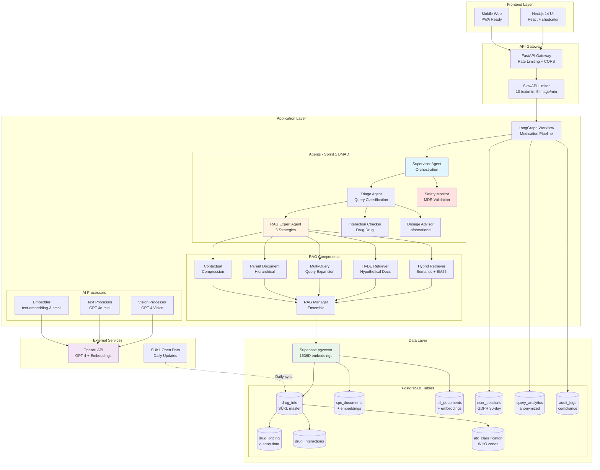
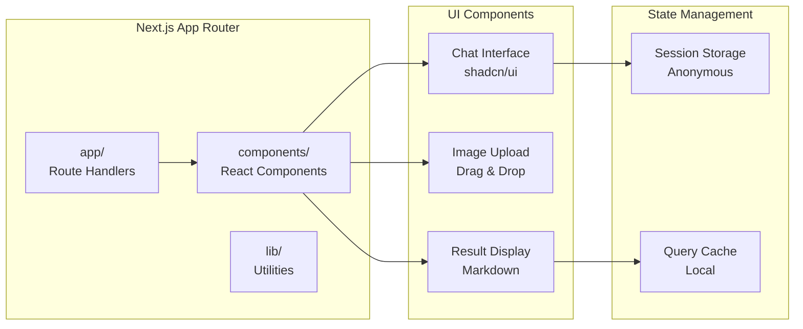
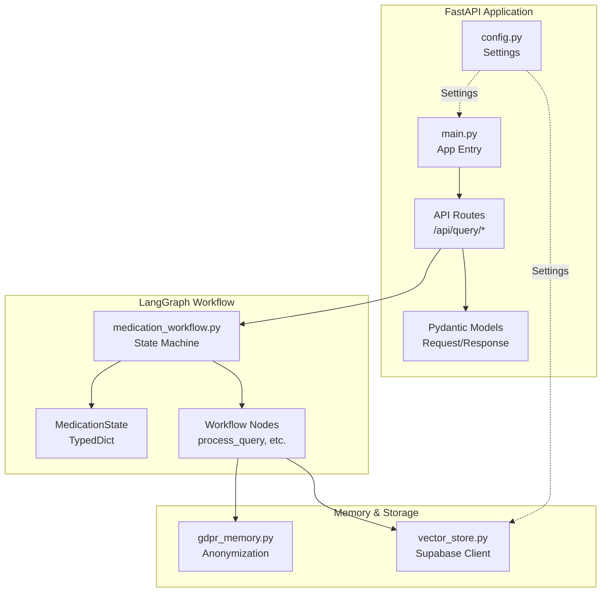
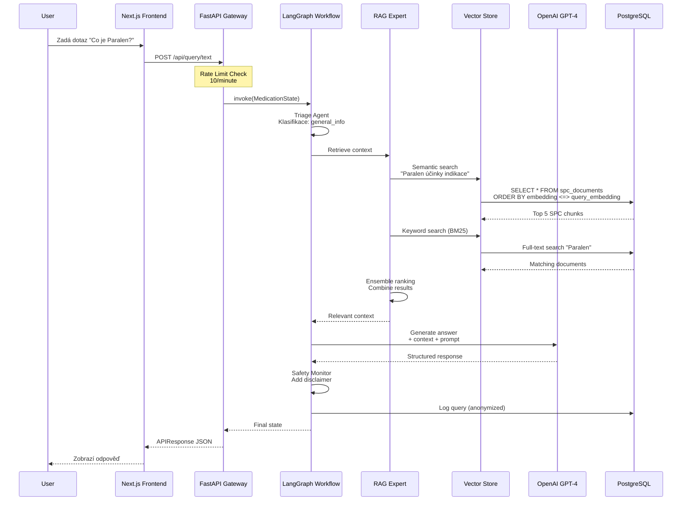
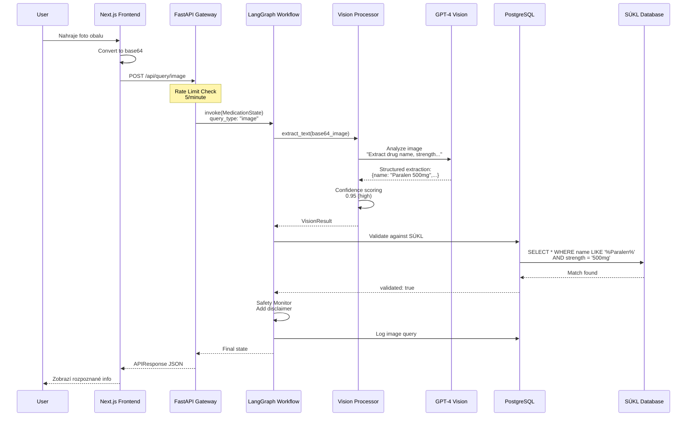
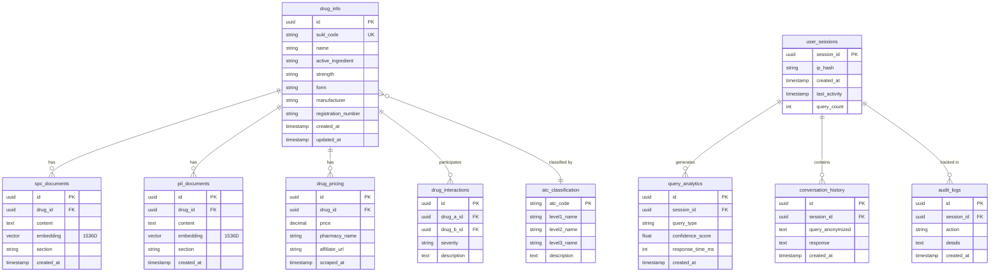
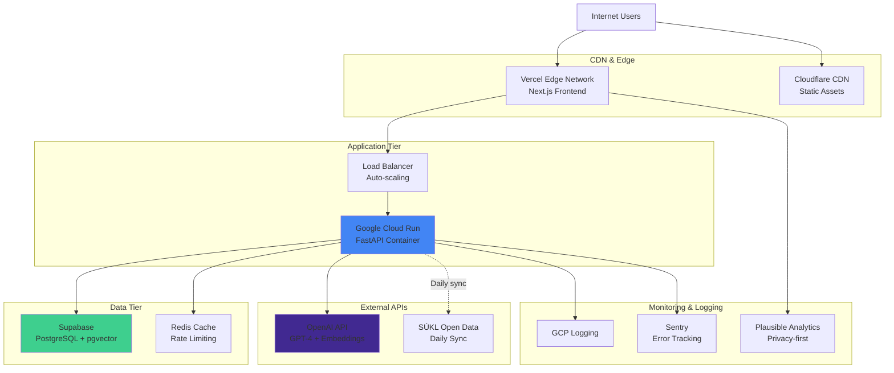

# PillSee - Architektura systému

## Přehled

PillSee je AI-powered chatovací platforma pro poskytování informací o léčivých přípravcích registrovaných v České republice. Systém kombinuje moderní RAG (Retrieval-Augmented Generation) techniky s oficiální databází SÚKL.

## Systémová architektura

## Component Architecture

### Frontend (Next.js 14)

### Backend (FastAPI + LangChain)

## Data Flow - Textový dotaz

## Data Flow - Obrázek léku

## Database Schema

### ER Diagram

## Deployment Architecture

## Technology Stack

### Frontend
- **Framework**: Next.js 14 (App Router)
- **UI Library**: React 18
- **Styling**: Tailwind CSS + shadcn/ui
- **State**: React Context + Session Storage
- **Deployment**: Vercel

### Backend
- **Framework**: FastAPI 0.109+
- **AI Orchestration**: LangChain + LangGraph
- **Language**: Python 3.11
- **Rate Limiting**: SlowAPI
- **Deployment**: Google Cloud Run (Docker)

### Database & Storage
- **Primary DB**: PostgreSQL 15 (Supabase)
- **Vector Store**: pgvector extension (IVFFlat indexes)
- **Cache**: Redis (rate limiting)
- **File Storage**: Supabase Storage (future)

### AI & ML
- **LLM**: OpenAI GPT-4o-mini (text queries)
- **Vision**: OpenAI GPT-4 Vision (image recognition)
- **Embeddings**: text-embedding-3-small (1536 dimensions)
- **RAG Framework**: LangChain

### DevOps & Monitoring
- **CI/CD**: GitHub Actions
- **Containerization**: Docker + docker-compose
- **Logging**: Google Cloud Logging
- **Error Tracking**: Sentry
- **Analytics**: Plausible (GDPR compliant)

## Security & Compliance

### GDPR Compliance
- Anonymní použití (žádná registrace)
- IP adresy hashované (SHA-256)
- 90-day data retention
- Žádné cookies/tracking
- Data minimalization

### MDR Class I (Medical Device Regulation)
- Pouze informační účely (ne diagnostika)
- Medical disclaimer u všech odpovědí
- Safety warnings pro kontraindikace
- Audit trail pro compliance
- Post-market surveillance ready

### Security Measures
- Rate limiting (IP-based)
- CORS whitelist
- Input validation (Pydantic)
- SQL injection prevention (ORM)
- XSS prevention (sanitization)
- No authentication = No credential leaks

## Scalability

### Horizontal Scaling
- **Frontend**: Edge functions (Vercel)
- **Backend**: Cloud Run auto-scaling (0-100 instances)
- **Database**: Supabase connection pooling

### Performance Optimization
- **Vector Search**: IVFFlat indexes (sub-linear search)
- **Caching**: Redis for rate limits
- **CDN**: Static assets cached globally
- **Lazy Loading**: React code splitting

### Cost Optimization
- **Serverless**: Pay-per-request (Cloud Run)
- **Vector Store**: Indexed queries only
- **OpenAI**: GPT-4o-mini for most queries (cheaper than GPT-4)
- **Batch Processing**: SÚKL updates once daily

## Future Enhancements (Phase 2+)

### Sprint 2 - RAG Enhancement
- A/B testing different RAG strategies
- Fine-tuned embeddings on Czech medical texts
- Query expansion with Czech synonyms
- Feedback loop for retrieval quality

### Sprint 3 - Feature Expansion
- User feedback system (thumbs up/down)
- Multi-language support (Slovak, English)
- Voice input (Web Speech API)
- Pharmacy locator integration

### Sprint 4 - Advanced Features
- Drug-food interactions
- Pregnancy/breastfeeding warnings
- Pediatric dosing calculator
- Side effect reporting integration

## Odkazy

- **PRD**: `/docs/prd.md`
- **Architecture Deep Dive**: `/docs/architecture.md`
- **BMAD Analysis**: `/docs/BMAD_*.md`
- **API Spec**: `/docs/api/openapi.yaml`
- **Deployment Guide**: `/docs/phase1/PillSee_DEPLOYMENT_GUIDE.md`
